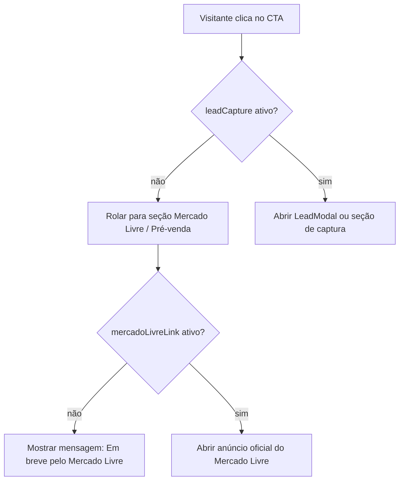

# 00 — Visão Geral da Arquitetura da LP

## Produto

A landing page do Angeled é a frente pública, comercial e institucional do produto.

Ela apresenta o Gerenciador Angeled, explica o uso residencial com fechaduras elétricas compatíveis e prepara a compra futura pelo Mercado Livre.

## Responsabilidade da LP

- Explicar o produto.
- Gerar confiança.
- Conduzir o visitante até a pré-venda.
- Publicar páginas legais.
- Preparar SEO e analytics.
- Preservar comunicação correta sobre compatibilidade, instalação e segurança.

## Fora da responsabilidade da LP

- Login.
- Cadastro real de usuário.
- Gestão de dispositivos.
- Comandos de fechadura.
- Integração com ESP32.
- Integração com app mobile.
- Checkout.
- Painel Admin.
- Backend operacional.

## Stack

```text
React
Vite
TypeScript
React Router DOM
lucide-react
CSS global com tokens
Vercel
```

## Rotas

```text
/             Home comercial
/privacidade  Política de Privacidade
/termos       Termos de Uso
```

## Arquitetura recomendada

```text
src/
  assets/
  components/
    layout/
    ui/
    sections/
  config/
  data/
  pages/
  services/
  styles/
  App.tsx
  main.tsx
```

## Fluxo de CTA



## Decisões fixas

- A LP não terá checkout próprio.
- O Mercado Livre é canal futuro.
- O CTA atual é “Avise-me quando estiver disponível”.
- A captura de lead começa desativada.
- Google Analytics é opcional e depende de env.

## Decisões pendentes

- Domínio oficial.
- OG image final.
- Foto/render real do hardware.
- Ativação ou não de formulário de interesse.
- Link real do anúncio do Mercado Livre.

